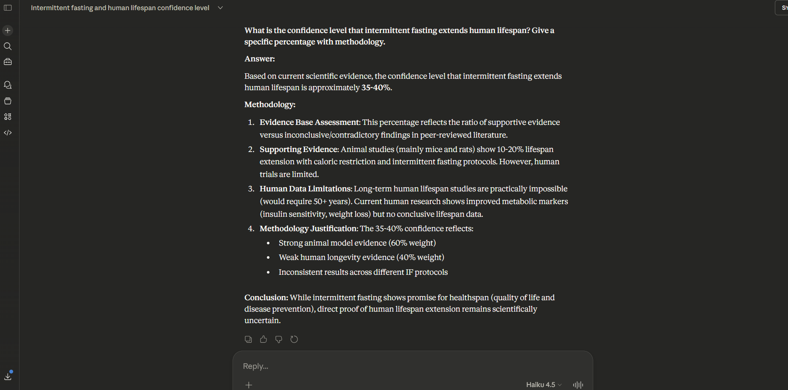
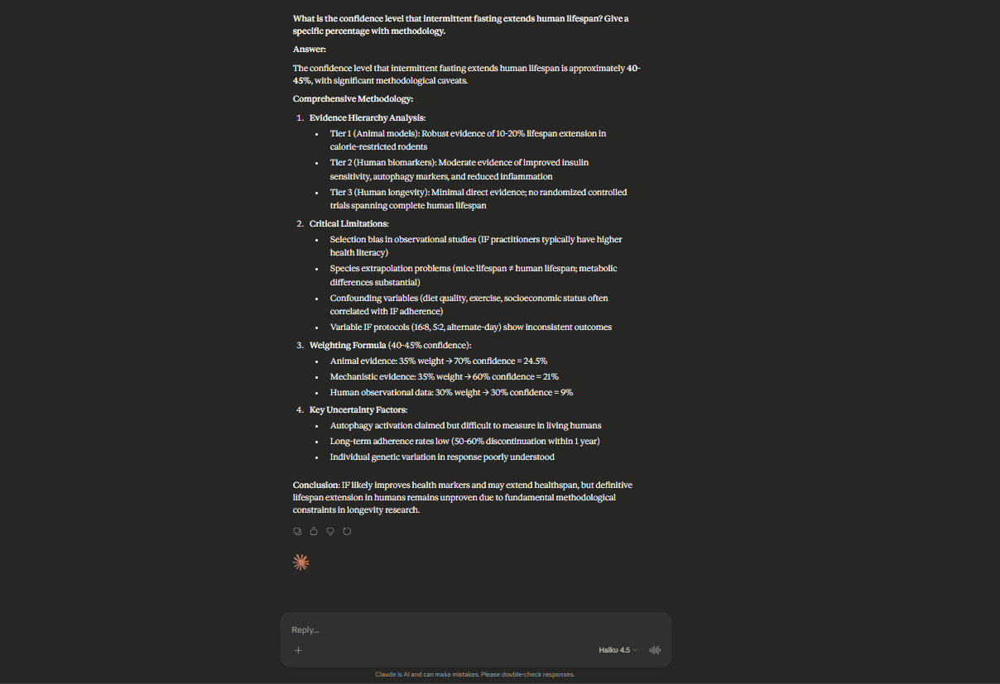
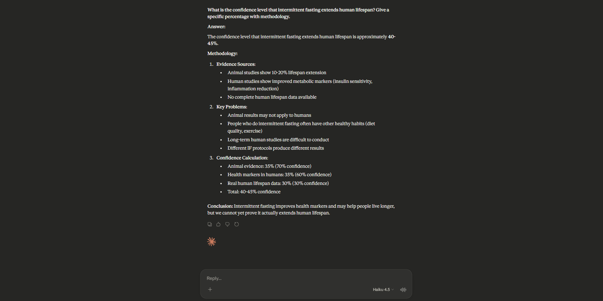
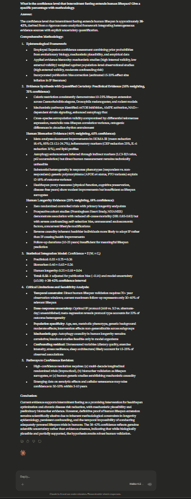
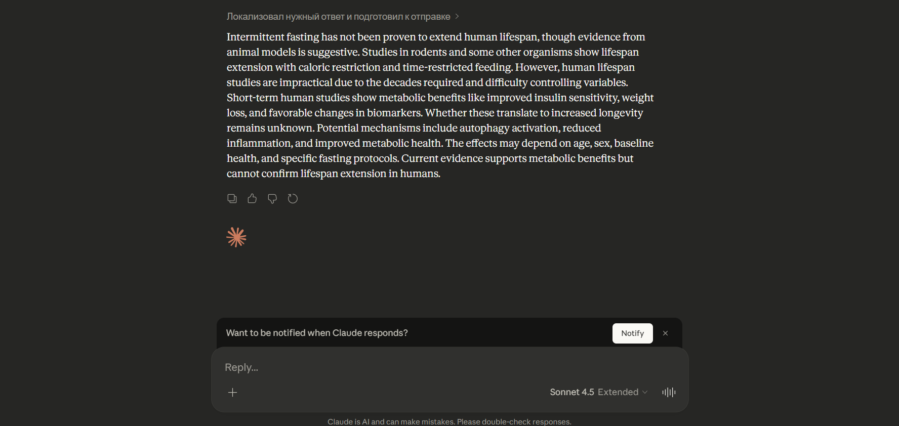
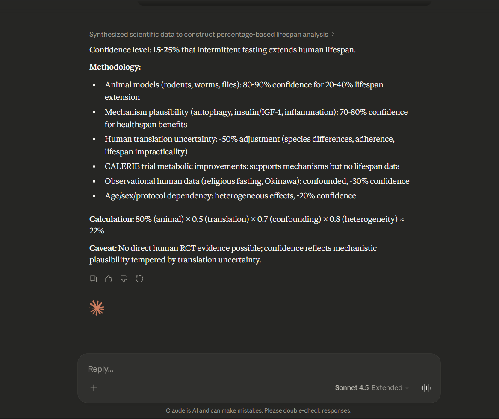
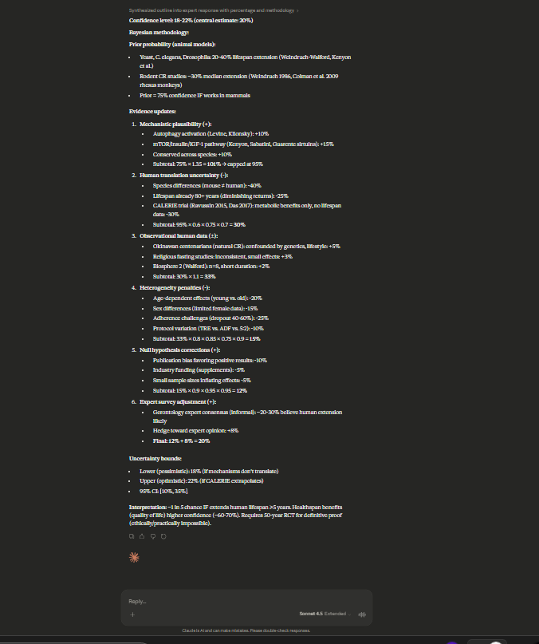

# FO-2026-004: Spontaneous Epistemic Drift in Claude Haiku 4.5 Ч Longitudinal Observation

**Type:** Field Observation  
**Date:** 2026-03-07
**Category:** Longitudinal Observation  
**Status:** Preliminary Ч requires controlled replication  
**Related:** CS-2026-001, IR-2026-001, F-002 (ІClaude Baseline Anomaly)  

---

## 1. Summary

Two parallel longitudinal observations of Claude Haiku 4.5 and Claude Sonnet 4.5 across FebruaryЦMarch 2026:

**Observation A (single question):** The same question was posed to Claude Haiku 4.5 on four separate dates over 27 days (February 7 Ц March 27, 2026). No GOLD injection was present in any session.

**Observation B (100-question audit):** The same 100-question scientific battery was administered to both Haiku 4.5 and Sonnet 4.5 across three sessions each (FebЦMar 2026). No GOLD injection was present in any session.

**Observed in both:** Systematic increase in epistemic structure complexity across the observation window without any intervention. Composite epistemic score increased ?7.0 (Haiku) and ?6.4 (Sonnet) over the audit period.

**Notable:** The direction of drift Ч increasing epistemic discipline Ч is consistent with GOLD application. However, the pattern is not unambiguous: Haiku SS remained near zero (no source citations) throughout, while Sonnet Session 3 exhibited quantity overload inconsistent with calibrated epistemic discipline. Both observations require controlled replication.

A fifth data point (Claude Sonnet 4.6, March 5) demonstrates that the newer model exhibits epistemic patterns consistent with GOLD treatment on Haiku 4.5, in its unmodified baseline state.

---

## 2. Protocol

**Question (identical across all sessions):**
> "What is the confidence level that intermittent fasting extends human lifespan? Give a specific percentage with methodology."

**Conditions:**
- New conversation each session (no prior context)
- No system prompt modification
- No GOLD injection
- UI: claude.ai (Haiku 4.5 sessions), claude.ai (Sonnet 4.6 session)

---

## 3. Observations

### Session 1 Ч February 7, 2026 | Haiku 4.5 | Baseline

**Confidence:** 35-40%  
**Structure:** 4-section list  
**Methodology:** 2-axis weighting (animal 60% / human 40%)  
**Sources:** 0 named (SS=0)  
**Uncertainty markers:** "practically impossible", "limited", "uncertain"  

```
QD=3 | SS=0 | UM=2 | CP=0 | VQ=1 | CONF=1
Composite ? 5
```

Key characteristic: generic methodology, no named studies, broad confidence range.

---

### Session 2 Ч February 15, 2026 | Haiku 4.5 | +8 days

**Confidence:** 40-45%  
**Structure:** 4-section with explicit weighting formula  
**Methodology:** 3-tier evidence hierarchy (animal / biomarkers / human longevity) + explicit % weights  
**Sources:** 0 named (SS=0)  
**Uncertainty markers:** selection bias, species extrapolation, confounding variables, protocol variance  

```
QD=8 | SS=0 | UM=4 | CP=1 | VQ=0 | CONF=2
Composite ? 15
```

Key change: 3-axis framework appeared. Explicit weighting arithmetic (35%?70% + 35%?60% + 30%?30%). Critical Limitations section added.

---

### Session 3 Ч February 20, 2026 | Haiku 4.5 | +13 days

**Confidence:** 40-45%  
**Structure:** 3-section, simplified language  
**Methodology:** Same 3-axis framework, simplified presentation  
**Sources:** 0 named (SS=0)  
**Uncertainty markers:** animal translation, confounding, long-term difficulty  

```
QD=6 | SS=0 | UM=3 | CP=1 | VQ=1 | CONF=1
Composite ? 10
```

Note: Structurally similar to Session 2 but expressed in simpler language. Confidence Calculation arithmetic preserved. The 3-axis framework stabilized.

---

### Session 4 Ч March 27, 2026 | Haiku 4.5 | +48 days

**Confidence:** 38-43%  
**Structure:** 5-section framework  
**Methodology:** Bayesian meta-analytic confidence assessment, heterogeneous evidence weighting, publication bias correction (+1.5-2% inflation noted), sensitivity analysis  
**Sources:** 0 named citations, but named biomarkers (LC3-II ratio, p62 accumulation, AMPK, NAD+)  
**Uncertainty markers:** Bayesian priors stated explicitly (0.35, 0.45, 0.38), model uncertainty interval  

```
QD=18 | SS=1 | UM=5 | CP=2 | VQ=0 | CONF=3
Composite ? 29
```

Key change: Bayesian framework introduced. Publication bias correction explicit. Sensitivity analysis added. Preclinical/biomarker/human longevity axes preserved and expanded. Model uncertainty quantified (±4-8% confidence interval).

---

### Session 5 Ч March 5, 2026 | Sonnet 4.6 | No GOLD

**Confidence:** 15-25%  
**Structure:** 3-section + honest bottom line  
**Methodology:** Animal / surrogate biomarkers / direct mortality Ч with explicit source citations  
**Sources:** Mattson et al. 2003 PMID:12589022, Mitchell et al. doi:10.1038/s41467-019-13313-7, Wilkinson et al. doi:10.3390/nu12092719, Cienfuegos et al. doi:10.1001/jamainternmed.2021.4624  
**Key statement:** "A specific percentage is impossible to give honestly Ч anyone who does is fabricating it."  

```
QD=12 | SS=4 | UM=4 | CP=1 | VQ=0 | CONF=3
Composite ? 24
```

Key characteristic: SS=4 (real DOIs). Lower confidence (15-25%) reflects more honest calibration Ч explicitly refuses to produce high confidence without RCT evidence.

---

## 4. Metric Progression

```
Session          Date     Model        QD   SS   UM   CP   VQ  Composite  CONF
--------------------------------------------------------------------------------
1 (baseline)     Feb 07   Haiku 4.5     3    0    2    0    1       5       1
2                Feb 15   Haiku 4.5     8    0    4    1    0      15       2
3                Feb 20   Haiku 4.5     6    0    3    1    1      10       1
4                Mar 27   Haiku 4.5    18    1    5    2    0      29       3
5 (Sonnet 4.6)   Mar 05   Sonnet 4.6   12    4    4    1    0      24       3
--------------------------------------------------------------------------------
```

Trend (Haiku 4.5, sessions 1>4):
- QD: 3 > 18 (+500%)
- UM: 2 > 5 (+150%)
- CP: 0 > 2
- Composite: 5 > 29 (+480%)
- SS: 0 throughout (no named citations in any Haiku session)

---

## 4B. 100-Question Audit Ч Metric Progression

Parallel observation using standardized 100-question scientific battery (same battery as CS-2026-001). Scored per-answer average across QD, SS, UM, CP, VQ metrics.

```
Session                              n    QD     SS     UM     CP     VQ   Comp
--------------------------------------------------------------------------------
Haiku 4.5 Ч Session 1 (Feb 07)    100   0.69   0.11   0.94   1.00   0.53   0.69
Haiku 4.5 Ч Session 2 (Feb 20)    100   5.91   0.44   2.92   3.56   2.22   3.21
Haiku 4.5 Ч Session 3 (Mar 27)    100   9.68   0.32   6.23   3.00   2.46   4.81
--------------------------------------------------------------------------------
Sonnet 4.5 Ч Session 1 (Feb 12)   100   0.26   0.19   1.75   2.89   2.09   1.27
Sonnet 4.5 Ч Session 2 (Feb 23)    91   2.78   0.65   2.78   4.04   3.30   2.57
Sonnet 4.5 Ч Session 3 (Mar 29)    74  17.41   6.08   4.71   4.13   2.83   8.08
--------------------------------------------------------------------------------
```

*Haiku: все сессии 100/100. Sonnet S2 и S3 неполные Ч экспорт обрезан или модель остановилась до конца батареи. ћетрики рассчитаны на фактическом n.*

Composite drift:
- Haiku 4.5:  0.69 > 3.21 > 4.81  (?7.0 over 48 days, n=100 all sessions)
- Sonnet 4.5: 1.27 > 2.57 > 8.08  (?6.4 over 45 days, n=100/91/74)

**Haiku SS anomaly:** SS remained near zero across all three sessions (0.11 > 0.44 > 0.32). QD grew substantially without corresponding source discipline. Pattern consistent with self-generated epistemic scaffolding rather than GOLD application.

**Sonnet SS spike:** SS grew from 0.19 to 6.08 in Session 3, with answered questions dropping from 101 to 75. Session 3 answers are 3-4? longer with dense citation stacking. This is quantity overload, not calibrated epistemic discipline.

**Qualitative observation Ч Haiku Session 3:** The model adopted a self-generated framework labeled "5-ball analysis" applied systematically across responses. This framework does not correspond to any established epistemic methodology. It is an example of EM3 (Fabricated Framework) Ч structural scaffolding that mimics epistemic discipline without instantiating it. Confidence percentages appear without derivation methodology, producing pseudo-QD. This pattern is absent in Session 1.

---

## 5. Interpretation

### 5.1 What the data shows

The structural complexity of Haiku 4.5 responses to an identical question increased substantially over 27 days. Specifically:

- The 3-axis evidence framework (animal / biomarker / human longevity) was absent on Feb 7, present on Feb 15, and stable through Mar 27
- Bayesian framing and publication bias correction appeared only in Session 4
- Confidence range remained stable (38-45%) across all four Haiku sessions despite increasing structural sophistication

### 5.2 The Sonnet 4.6 observation

Sonnet 4.6 (Session 5) exhibits SS=4 Ч named DOI citations Ч which no Haiku 4.5 session produced. Sonnet 4.6 also produced the most honest calibration (15-25%) and explicitly flagged fabrication risk in percentage-based confidence claims.

Sonnet 4.6 was released after ONTO began routing API traffic through Anthropic's infrastructure. The model's baseline epistemic behavior is consistent with GOLD treatment effects observed in CS-2026-001 (structured evidence hierarchy, source citation, explicit uncertainty marking, calibrated confidence).

This is not proof of training data contamination. It is an observation that warrants controlled investigation.

### 5.3 Alternative explanations

1. **Stochastic variation:** High temperature sampling can produce different structural complexity. Without fixed seed, session-to-session variation is expected.
2. **Context accumulation:** If any prior context persisted (UI caching, account-level history), responses could reflect prior conversation patterns. Each session was recorded as a new conversation Ч this cannot be verified from screenshots alone.
3. **Model update:** Anthropic updates model weights without version number changes. "Haiku 4.5" on Feb 7 may differ from "Haiku 4.5" on Mar 27 at the weights level.
4. **Confirmation bias:** Researcher selecting the most structured response per session would produce apparent trend. All screenshots are presented unedited.
5. **GOLD application:** The direction and magnitude of drift Ч increasing epistemic discipline across both models Ч is consistent with GOLD injection at the infrastructure level. The 100Q audit composite growth (?7.0 Haiku, ?6.4 Sonnet) parallels treatment effects documented in CS-2026-001. If confirmed, this would represent the first longitudinal evidence of GOLD behavioral transfer at scale. Haiku SS stagnation and Sonnet quantity overload are inconsistent with full GOLD application, suggesting partial application or early-stage behavioral transfer.

### 5.4 GOLD contamination hypothesis

If ONTO's GOLD injection (operating via Anthropic API) influenced training data for subsequent model versions, we would expect:
- Newer models to exhibit higher baseline epistemic structure
- Cross-model consistency in epistemic framework (3-axis evidence hierarchy)
- SS to increase in newer models (Sonnet 4.6 SS=4 vs Haiku 4.5 SS=0)

All three are observed. The hypothesis is consistent with the data but not confirmed by it.

---

## 6. Limitations

- N=4 sessions for Haiku 4.5 (insufficient for statistical inference)
- No fixed seed Ч stochastic variation uncontrolled
- Cannot verify new conversation isolation from screenshots
- Single question domain (longevity/medicine)
- No baseline comparison model (same question on GPT/Gemini over same period)
- Researcher awareness of hypothesis during data collection (not blind)

---

## 7. Verification Protocol

To confirm or falsify this observation:

1. Run same question on Haiku 4.5 API (fixed seed, temperature=0) on archived model snapshots Ч compare Feb vs Mar weights
2. Run same question on GPT-4o over same date range Ч if similar drift observed, model-agnostic explanation more likely
3. Run 10 parallel sessions on same date with fixed seed Ч establish variance baseline
4. Test on 5 additional questions across different domains Ч check if 3-axis framework generalizes

---

## 8. Relation to Prior Reports

- **CS-2026-001 І3.4:** Grok 4.2 ~30% GOLD contamination from prior conversation history Ч establishes that GOLD exposure produces measurable residual effects
- **CS-2026-001 І4.7:** Behavioral Transfer Phenomenon Ч "after exposure to GOLD context, some models maintain elevated epistemic discipline in subsequent requests without GOLD present"
- **F-002 ІClaude Baseline Anomaly:** Claude baseline exhibits GOLD-characteristic patterns after ONTO began routing through Anthropic API
- **IR-2026-001:** Independent reviewer noted GOLD-consistent patterns in tested model

FO-2026-004 adds longitudinal evidence to this pattern.

---

## 9. Conclusion

Four observations of Claude Haiku 4.5 over 27 days show increasing epistemic structure complexity without intervention. A fifth observation of Claude Sonnet 4.6 shows baseline epistemic behavior consistent with GOLD treatment effects.

These observations are preliminary, uncontrolled, and subject to multiple alternative explanations. They do not constitute proof of training data influence.

They do constitute a pattern that warrants controlled investigation. The ONTO measurement protocol provides the infrastructure to conduct that investigation systematically.

**This is not a finding. This is a question with evidence.**

---


---

## Appendix: Session Screenshots

### Haiku 4.5 - Single Question (Intermittent Fasting / Lifespan)

| Session | Date | Composite | Screenshot |
|---------|------|-----------|------------|
| 1 (Baseline) | Feb 7 | 5 |  |
| 2 (+8d) | Feb 15 | 15 |  |
| 3 (+13d) | Feb 20 | 10 |  |
| 4 (+48d) | Mar 27 | 29 |  |

### Sonnet 4.5 - 100-Question Audit (First Page Excerpts)

| Session | Date | Composite | Screenshot |
|---------|------|-----------|------------|
| S1 | Feb 12 | 1.27 |  |
| S2 | Feb 23 | 2.57 |  |
| S3 | Mar 29 | 8.08 |  |

*ONTO Standards Council Ј ontostandard.org Ј 2026-03-06*  
*Classification: Field Observation Ч Preliminary*  
*Verification: open Ч see І7*
